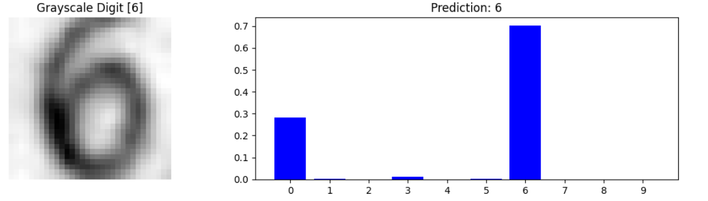

# SVHN Image Classifier with CNN

This project demonstrates how to build and train a Convolutional Neural Network (CNN) model to classify images from the Street View House Numbers (SVHN) dataset. The model is built using TensorFlow and Keras.

## Project Overview

The goal of this project is to develop a CNN model that can accurately classify images of digits from the SVHN dataset. The model is trained on the cropped digit format of the dataset (`train_32x32.mat`, `test_32x32.mat`).

## Dataset

The SVHN (Street View House Numbers) dataset is obtained from real-world images of house numbers in Google Street View images. It contains over 600,000 labeled digits, making it an excellent dataset for training machine learning and deep learning models for digit recognition tasks.

### Dataset Details:

- **Source:** [Stanford UFLDL SVHN Dataset](http://ufldl.stanford.edu/housenumbers/)
- **Format:** The project uses the Format 2: Cropped Digits version of the dataset, specifically the `train_32x32.mat` and `test_32x32.mat` files.
- **Description:** Each image in the dataset is a 32x32 pixel RGB image, and the digits range from 0 to 9. The digit '0' is labeled as '10' in the dataset, which has been preprocessed in this project to convert it back to '0'.

The SVHN dataset is widely used for developing and benchmarking models for digit classification tasks due to its challenging nature and high-quality labeled data.

## Model Architecture

The model is a Convolutional Neural Network (CNN) with the following architecture:

- **Input:** 32x32 grayscale images
- **Convolutional Layers:** 4 Conv2D layers with ReLU activation, followed by MaxPooling2D and BatchNormalization layers
- **Fully Connected Layers:** Flatten layer followed by a Dense layer with 128 units and Dropout set to 0.5
- **Output Layer:** Dense layer with 10 units and softmax activation

## Results

- **Test Accuracy:** 91.13%
- **ROC AUC Score:** 0.9920
- **Confusion Matrix:** The model performed well across most classes, with precision and recall values ranging between 0.85 and 0.95 for most classes.

### Performance Summary

The model showed strong performance with a high test accuracy and ROC AUC score. Overfitting was managed using Dropout and Early Stopping techniques, leading to a well-generalized model.

## Model Training and Evaluation

The model was trained over 20 epochs, with early stopping applied to prevent overfitting. Validation accuracy peaked at 91.72%, with a final test accuracy of 91.13%. The classification report shows balanced precision and recall across all digit classes.

### Sample Predictions

Below are some sample predictions made by the model:

